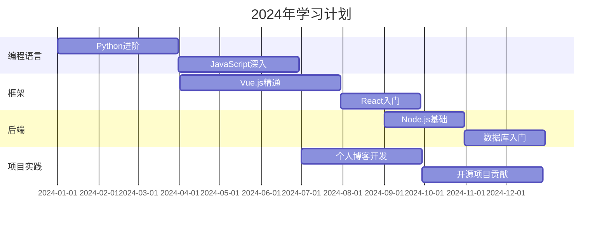

<h1 align="center">
  <a href="https://soulhome.yc46.cn">
    
  </a>
</h1>
<p align="center">
  
</p>
<p align="center">
  
  
</p>
[The rest of the content remains the same]

## 👾 关于我

```python
class SoulCoder:
    def __init__(self):
        self.name = "幻魂-朱智昇"
        self.role = "中学 | 编程爱好者"
        self.language_spoken = ["中文", "English"]
        self.code = ["Python", "JavaScript", "Vue", "HTML", "CSS"]
        self.tools = ["Git", "GitHub", "Vercel", "Render"]
        self.interests = ["Web开发", "人工智能", "数据可视化", "开源项目"]

    def say_hi(self):
        print("感谢你访问我的GitHub主页！让我们一起探索代码的无限可能吧！🚀")

me = SoulCoder()
me.say_hi()
```

## 🏆 GitHub 成就

<p align="center">
  
</p>

## 🌐 技能矩阵

<table>
  <tr>
    <td>
      
    </td>
    <td>
      
    </td>
  </tr>
</table>

## 🚀 技术栈

<p align="center">
  
  
  
  
  
  
</p>

## 📊 编程活跃度

<p align="center">
  
</p>

## 🌟 项目展示

<p align="center">
  <a href="#"></a>
</p>

> 💡 正在开发令人兴奋的项目，敬请期待！

## 📈 贡献概览

<p align="center">
  
</p>

<p align="center">
  
  
</p>

[The rest of the content remains the same]

## 🎯 2024技术路线图



## 📫 联系方式

<p align="center">
  <a href="mailto:souls2906@gmail.com">
    
  </a>
</p>

<h2 align="center">🌈 让我们一起创造未来!</h2>

<p align="center">
  
</p>

<p align="center">
  
  
</p>

---

<p align="center">
  
</p>
